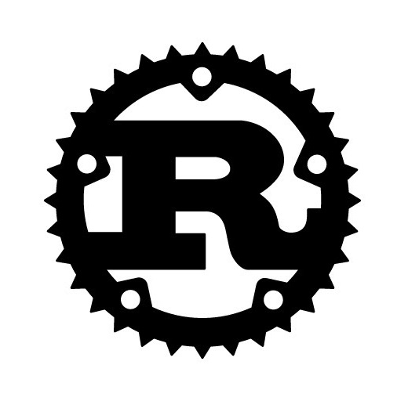

## Sysadmin, almost-physicist (junior)
<!--
**birrabenzina/birrabenzina** is a ✨ _special_ ✨ repository because its `README.md` (this file) appears on your GitHub profile.

Here are some ideas to get you started:

- 🔭 I’m currently working on strimnizire piselo 😳
- 🌱 I’m currently learning ramzismo
- 👯 I’m looking to collaborate on ridurre il 53% dei crimini negli stati uniti
- 🤔 I’m looking for help with 😳
- 💬 Ask me about 😳
- 📫 How to reach me: non farlo 😳
- 😄 Pronouns: cazzo/piccolo
- ⚡ Fun fact: gli n mangmgiano la mermnda x rimangmere di kuel colore 😳😳😳😳
-->
#:hammer_and_wrench: Tools I use:
<div>
    <ul>
        <code></code>
        <code></code>
        <code></code>
        <code></code>
        <code></code>
        <code></code>
        <code></code>
        <code></code>
        <code></code>
        <code></code>
        <code></code>
        <code></code>
        </ul>
</div>
<div>
	Languages I want to learn learn:<br/>
	<code></code>
	<code></code>
	<code></code>
	<code></code>
	<code></code>
	<code></code>
	<code></code>
	<code></code>
</div>
<br/>
<div>
	Enjoy my <a href="https://github.com/birrabenzina/dots">dots</a> repo, I keep scripts and rices there, while <a href="https://github.com/birrabenzina/spicyphysics">here</a> you can get my physics notes, enjoy!
</div>
<br/>
<div></div>
<br/>
<!--<div></div>-->
<div></div>
<br/>
<div>
btw:</br>

</br>
I use Arch
</div>
	<!--<br/>
	<pre style="text-align:center;">
		<font style="color:#54FFFF;"><b> 	           -`</b></font> 
		<font style="color:#54FFFF;"><b>                  .o+`</b></font>                  
		<font style="color:#54FFFF;"><b>                 `ooo/</b></font>                  
		<font style="color:#54FFFF;"><b>                `+oooo:</b></font>                 
		<font style="color:#54FFFF;"><b>               `+oooooo:</b></font>                
		<font style="color:#54FFFF;"><b>               -+oooooo+:</b></font>               
		<font style="color:#54FFFF;"><b>             `/:-:++oooo+:</b></font>              
		<font style="color:#54FFFF;"><b>            `/++++/+++++++:</b></font>             
		<font style="color:#54FFFF;"><b>           `/++++++++++++++:</b></font>            
		<font style="color:#54FFFF;"><b>          `/+++ooooooooooooo/`</b></font>          
		<font style="color:#54FFFF;"><b>         ./ooosssso++osssssso+`</b></font>         
		<font style="color:#54FFFF;"><b>        .oossssso-````/ossssss+`</b></font>        
		<font style="color:#54FFFF;"><b>       -osssssso.      :ssssssso.</b></font>       
		<font style="color:#54FFFF;"><b>      :osssssss/        osssso+++.</b></font>       
		<font style="color:#54FFFF;"><b>     /ossssssss/        +ssssooo/-</b></font>      
		<font style="color:#54FFFF;"><b>   `/ossssso+/:-        -:/+osssso+-</b></font>    
		<font style="color:#54FFFF;"><b>  `+sso+:-`                 `.-/+oso:</b></font>   
		<font style="color:#54FFFF;"><b> `++:.                           `-/+/</b></font>
		<font style="color:#54FFFF;"><b> .`                                 `/</b></font>
	</pre>
	I use Arch
</div><br/>
-->
