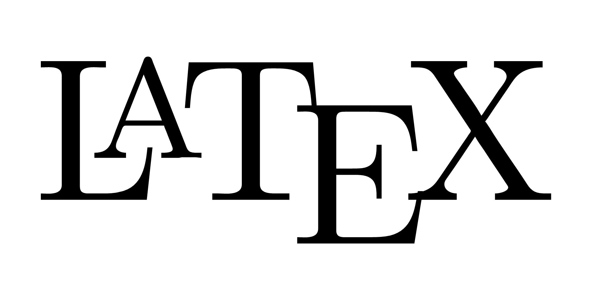
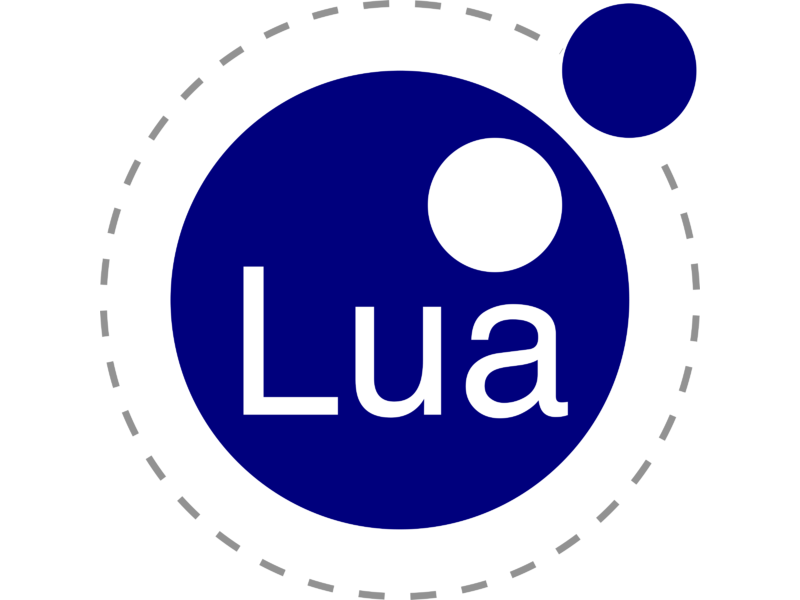

## Sysadmin, physics student and aspiring DevOps
<!--
**birrabenzina/birrabenzina** is a ✨ _special_ ✨ repository because its `README.md` (this file) appears on your GitHub profile.

Here are some ideas to get you started:

- 🔭 I’m currently working on ...
- 🌱 I’m currently learning ...
- 👯 I’m looking to collaborate on ...
- 🤔 I’m looking for help with ...
- 💬 Ask me about ...
- 📫 How to reach me: ...
- 😄 Pronouns: ...
- ⚡ Fun fact: ...
-->

Languages I know to some extent and level with CEFR:
<ul>
	<li>C2: <code></code></li>
	<li>C1: <code></code></li>
	<li>B2: <code></code> <code></code></li>
	<li>B1: <code></code> <code></code> <code></code></li>
	<li>A2: <code></code> <code></code> <code></code></li>
</ul>

<code></code>
<code></code>
<code></code>
<code></code>
<code></code>

Codewars level: 
 

